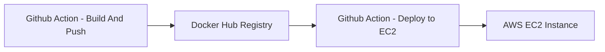

# Timeflow
[](https://github.com/Balaguru4580/TimeFlow/actions/workflows/docker-image.yml)

Timeflow is a simple timer app based on the Skinner Box concept. Uses psychology-based incentive features to help users stay motivated while managing their time, through positive reinforcement via customizable rewards.

## Project Architecture

This project is a **full-stack web application** with:

- **Frontend:**  
  - Built with **Svelte** and **Vite**  
  - Written in **TypeScript**  
  - Uses **Skeleton** as a UI component library.

- **Backend:**  
  - Implemented with **Node.js** and **Express.js**  
  - **PostgreSQL** is used as the primary database.

- **Infrastructure:**  
  - **Nginx** acts as a reverse proxy to route requests between the frontend and backend.  
  - The entire application is **containerized with Docker** and orchestrated using **Docker Compose** for easy deployment.
  - Automated build, test, and deployment, with CD/CD pipelines using **GitHub Actions**.  
  - Code is automatically built, and upon passing, deployed to an **AWS EC2** instance on push to the main branch.



## Run this project

### Run with Docker (recommended)

To run the full app (frontend, backend, and database) using Docker:

```bash
docker compose up --build
```

Then open your browser at localhost, at port 80. This can be changed in the nginx entry within docker-compose.yml.

To stop everything:

```bash
docker compose down
```

### Local Development (manual)

If you prefer to run locally without Docker:

1. **Frontend**
   Navigate to the `frontend` folder and run:

   ```bash
   yarn dev
   ```

   Starts the development server.

2. **Backend**
   Navigate to the `backend` folder and run:

   ```bash
   node ./server.js
   ```

You can find these commands in the `package.json` files.


### Production Deployment

For deploying Timeflow to a production environment like an EC2 instance, use docker-compose.prod.yml as follows:

```bash
docker compose -f docker-compose.prod.yml up -d --build
```

### Database Setup

* With **Docker**, the database runs automatically as a container.
* For **local setup**, you’ll need to install PostgreSQL manually on your PC and configure the environment variables in a `.env` file.
